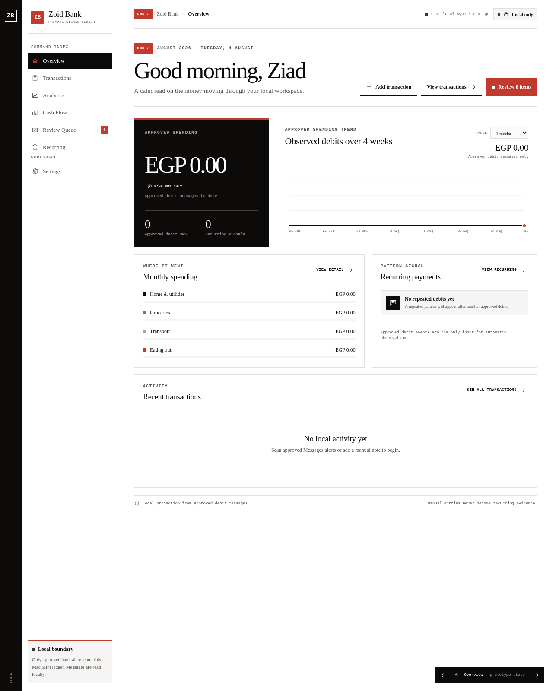

# Zoid Bank

<p align="center">
  
</p>

A local-first finance companion that turns bank SMS alerts into an evidence-backed ledger — without leaving your Mac Mini.

**Who it's for.** Anyone who wants a private view of Bank Al Ahly and Banque Misr activity, recurring payments, and reviewable imports on one machine — with nothing uploaded.

## What you get

- Incoming Bank Al Ahly and Banque Misr alerts become structured ledger events
- Recurring payment projections built only from approved debit evidence
- A Review Queue so ambiguous alerts never quietly inflate totals
- Read-only Messages access — nothing is sent, marked read, edited, deleted, or uploaded
- A native macOS window plus a local dashboard for everyday use

## Try it

A public preview of the dashboard: [financial-transactions-vert.vercel.app](https://financial-transactions-vert.vercel.app)

The full companion (Messages bridge + native window) is still local-only:

```bash
npm start
```

Open [http://127.0.0.1:4173/?variant=settings](http://127.0.0.1:4173/?variant=settings).

Messages bridge, production package, LaunchAgent install, and the native app live in [docs/local-setup.md](docs/local-setup.md).

## How it works

A read-only macOS helper opens `~/Library/Messages/chat.db`. The bridge binds only to `127.0.0.1:4317`. Validated transaction patterns are approved automatically; OTPs and notices are ignored; ambiguous alerts go to Review Queue. Recurring signals are observations, not scheduled payments — the dashboard never executes a payment.

---

Built by [Ziad Ahmed](https://github.com/Ziad-NasrEldin) at [MaVoid](https://mavoid.com).

[Website](https://mavoid.com) · [LinkedIn](https://linkedin.com/in/ziad-ahmed-634202332) · [GitHub](https://github.com/Ziad-NasrEldin)

